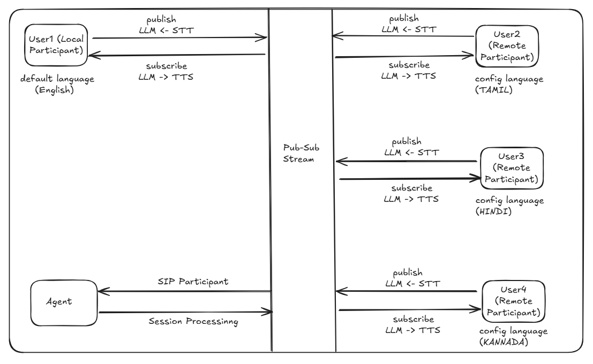

# Multi-Meet — Real-time multilingual audio rooms

**Hackathon project:** Break the language barrier in live audio meetings. People across India speak in their own regional language; the room keeps a single **base language (English)** in the stream and an **AI agent** translates in low latency using **Gemini 3 Flash**, so everyone can participate without language being a barrier.

---

## Problem: multi-lingual barrier in India

India has hundreds of languages and dialects. In remote meetings, webinars, and community calls, participants often can’t follow when others speak in a different language. Forcing everyone to speak one language excludes people who are more comfortable in their mother tongue. We wanted:

- **One shared “stream” language** (English) so the meeting has a single reference.
- **Speak in your own language** — Hindi, Tamil, Telugu, Bengali, or any supported language.
- **Low-latency translation** so the room feels live, not delayed.
- **No extra burden on participants** — an agent does the work in the background.

---

## Solution: agent-driven room streaming + Gemini translation

We use **LiveKit** for real-time audio rooms and two **agents** that run in the cloud:

1. **Transcriber agent** — Listens to each participant’s audio, runs **speech-to-text (STT)**, and publishes a **live transcript** into the room. The transcript is the “base” layer: we treat **English** as the canonical language in the stream (transcript + translated output).
2. **Translator agent** — Subscribes to that transcript stream, sends each **final** segment to **Gemini 3 Flash** for translation (e.g. regional language → English, or English → Hindi), then uses **ElevenLabs TTS** to synthesize speech and **publishes a live audio track** in the same room. Everyone hears the original mic plus the translated track, so the room is not a barrier to anyone.

**Flow in short:**  
*Participant speaks (e.g. Hindi) → STT (transcript) → Gemini translates (e.g. Hindi → English) → TTS (English audio) → published as a track in the room. Others see transcript in English and hear the translated track.*

We keep the **base language of the stream as English** (transcript + optional translated track), while allowing people to **talk in their regional language**; the agent handles translation in **low latency** using **Gemini 3 Flash**, so the room stays inclusive and real-time.

---

## What’s implemented

- **Room creation and join (LiveKit)** — Create a room from the landing page, share the link; others join by name. Audio-only; no video.
- **Token storage (Redis / Upstash)** — Tokens stored server-side for persistence (e.g. rejoin).
- **Transcription** — A **transcriber agent** is dispatched per room (via token). It runs STT only (e.g. Deepgram via LiveKit Inference), publishes to **`lk.transcription`**. The UI shows a live transcript (participant name + text).
- **Translation** — A **translator agent** subscribes to **`lk.transcription`**, translates each final segment with **Gemini 3 Flash**, synthesizes speech with **ElevenLabs TTS**, and publishes a **live audio track** (e.g. Hindi) in the room. Participants hear it via the same room audio (no extra UI).
- **Speaking state** — LiveKit voice activity; console logs when someone is speaking / stopped.

---

## Technical overview

### Architecture



```
┌─────────────────────────────────────────────────────────────────────────┐
│  Browser (Next.js)                                                       │
│  - Create / join room, get token                                         │
│  - LiveKit room: publish mic, subscribe to audio + lk.transcription     │
│  - UI: participant list, transcript (useTranscriptions), RoomAudioRenderer│
└─────────────────────────────────────────────────────────────────────────┘
                    │ token (RoomAgentDispatch: transcriber, translator)
                    ▼
┌─────────────────────────────────────────────────────────────────────────┐
│  LiveKit Cloud                                                           │
│  - Room: participants + agents                                           │
│  - transcriber agent: subscribe participant audio → STT → lk.transcription│
│  - translator agent: subscribe lk.transcription → Gemini → TTS → track   │
└─────────────────────────────────────────────────────────────────────────┘
                    │
                    ▼
┌─────────────────────────────────────────────────────────────────────────┐
│  External APIs                                                           │
│  - LiveKit Inference (e.g. Deepgram Nova-3) for STT                      │
│  - Gemini 3 Flash (generativelanguage.googleapis.com) for translation  │
│  - ElevenLabs for TTS (PCM 24kHz for agent track)                        │
└─────────────────────────────────────────────────────────────────────────┘
```

- **Base language in the stream:** Transcript and translated content are treated as **English** (or a single target language) so the “meeting stream” is consistent; participants can speak in any supported regional language.
- **Low latency:** Gemini 3 Flash is used for fast translation of short segments; transcriber emits final segments so the translator runs per phrase, not per full recording.

### Data flow (translation)

1. Participant speaks → **Transcriber** gets audio, runs STT, publishes to **`lk.transcription`** (with `lk.transcription_final` for final segments).
2. **Translator** registers a handler on **`lk.transcription`**. On each **final** segment: read text → **Gemini 3 Flash** (translate, e.g. regional → English or en → hi) → **ElevenLabs TTS** (PCM 24 kHz) → chunk into 20 ms frames → **AudioSource** → **LocalAudioTrack** published in the room.
3. All participants **subscribe** to that track; **RoomAudioRenderer** plays it with the rest of the room audio.

### Tech stack

| Layer | Technology |
|-------|------------|
| App | Next.js 16 (App Router), React 19, Tailwind |
| Real-time | LiveKit (`livekit-server-sdk`, `@livekit/components-react`, `livekit-client`), audio-only |
| Storage | Upstash Redis (REST) for token persistence |
| STT | LiveKit Inference (e.g. Deepgram Nova-3) in transcriber agent |
| Translation | Gemini 3 Flash (`generativelanguage.googleapis.com`) |
| TTS | ElevenLabs (MP3 for batch API; PCM 24 kHz for translator agent) |
| Conventions | neverthrow for server actions; Drizzle where applicable; no raw SQL |

### Repo layout (main pieces)

| Path | Role |
|------|------|
| `multi-meet/app/page.tsx` | Landing: name, Create room, Join room |
| `multi-meet/app/room/[roomName]/page.tsx` | Room page wrapper |
| `multi-meet/components/audio-room.tsx` | LiveKit room UI, transcript (useTranscriptions), RoomAudioRenderer |
| `multi-meet/app/api/room/create/route.ts` | Create room, issue token, store in Redis |
| `multi-meet/app/api/room/join/route.ts` | Join room, issue token, store in Redis |
| `multi-meet/lib/livekit.ts` | createRoom, createToken; RoomAgentDispatch for transcriber + translator |
| `multi-meet/lib/gemini-translate.ts` | translateText (Gemini 3 Flash) |
| `multi-meet/lib/elevenlabs-tts.ts` | synthesizeSpeech (MP3), synthesizeSpeechPcm (PCM for agent) |
| `multi-meet/transcriber/main.ts` | Transcriber agent: one session per participant, STT → lk.transcription |
| `multi-meet/translator/main.ts` | Translator agent: lk.transcription → Gemini → TTS → publish Hindi (or other) track |
| `multi-meet/docs/TRANSLATION-STREAM-PLAN.md` | Translation stream and pub/sub design |

---

## Environment variables (`multi-meet/.env`)

**Required for rooms and Redis:**

| Variable | Purpose |
|----------|--------|
| `LIVEKIT_URL` | LiveKit server URL (e.g. `wss://xxx.livekit.cloud`) |
| `LIVEKIT_API_KEY` | LiveKit API key |
| `LIVEKIT_API_SECRET` | LiveKit API secret |
| `NEXT_PUBLIC_LIVEKIT_URL` | Same LiveKit URL for browser |
| `UPSTASH_REDIS_REST_URL` | Upstash Redis REST URL (optional; tokens still work without it) |
| `UPSTASH_REDIS_REST_TOKEN` | Upstash Redis REST token |

**Translator agent (multi-lingual output):**

| Variable | Purpose |
|----------|--------|
| `GEMINI_API_KEY` | Gemini API key (translation via Gemini 3 Flash) |
| `ELEVEN_API_KEY` | ElevenLabs API key (TTS for translated track) |

Transcriber uses LiveKit (and LiveKit Inference for STT); no extra keys for basic setup.

---

## How to run

**1. App**

```bash
cd multi-meet
bun install
bun run dev
```

Open **http://localhost:3000** (or the URL shown; dev server listens on `0.0.0.0` for LAN access).

**2. Transcriber (required for live transcript)**

From `multi-meet/`:

```bash
bun run transcriber:download-files   # once
bun run transcriber:dev
```

**3. Translator (required for translated audio track)**

From `multi-meet/`, with `GEMINI_API_KEY` and `ELEVEN_API_KEY` set:

```bash
bun run translator:dev
```

Run app + transcriber + translator together for full flow: live transcript + translated track so the room is not a barrier for multi-lingual participants.

---

## How to test

1. **Tab 1:** Open the app → enter name → **Create room** → copy room URL.
2. **Tab 2 (or another device on LAN):** Open URL → enter name → **Join**.
3. In both: unmute and speak. Transcript appears when the transcriber is running; translated track is heard when the translator is running (same room audio).

---

## Summary

Multi-Meet uses **room streaming** with a **fixed base language (English)** in the transcript and translated output. Participants can **speak in their regional language**; the **transcriber** turns speech into text and the **translator** uses **Gemini 3 Flash** for **low-latency translation** plus ElevenLabs TTS, publishing a live audio track in the room. That keeps the room **inclusive** and **language no longer a barrier** for hackathon demos and real-world meetings in India.
