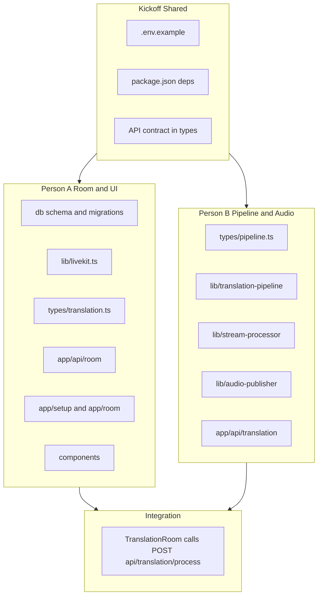

# Real-Time Multilingual Translation Layer – Two-Person Team Plan

## Current state

- **App**: Next.js 16 (React 19, Tailwind 4) in `multi-meet/` – default CNA template.
- **Conventions**: **Drizzle** for DB (no raw SQL). **neverthrow** for server actions and API handlers.

## Two-person module split

Work is split into two **parallel tracks** that touch **disjoint sets of files**. Integration happens only at a single, contract-based API so there are no dependency conflicts.



---

## File ownership (no overlap)

| Owner | Files / directories |
|-------|----------------------|
| **Person A** | `db/`, `lib/livekit.ts`, `types/translation.ts`, `app/api/room/`, `app/setup/`, `app/room/`, `components/`, `app/page.tsx`, `app/layout.tsx`, `drizzle.config.ts` |
| **Person B** | `types/pipeline.ts`, `lib/translation-pipeline.ts`, `lib/stream-processor.ts`, `lib/audio-publisher.ts`, `app/api/translation/` |
| **Shared (kickoff)** | `.env.example`, `package.json` (coordinate: A adds room/db deps, B adds pipeline deps in separate commits or one combined setup) |

**Rule**: Do not edit files owned by the other person. Person A may **import** from `types/pipeline.ts` (read-only). Person B may **import** from `types/translation.ts` and `db` (read-only) for participant/language data.

---

## API contract (integration boundary)

The only integration point is one API route implemented by Person B and called by Person A.

- **Route**: `POST /api/translation/process`
- **Request type** (defined in `types/pipeline.ts` by Person B):

```ts
// types/pipeline.ts - Person B owns this file
export type ProcessTranslationRequest = {
  roomId: string
  speakerId: string
  speakerLanguage: string
  audioBase64?: string
  targetParticipants: Array<{ id: string; language: string }>
}
```

- **Response**: `{ ok: true }` or `{ ok: false, error: string }`. Person A only needs success/failure for UI/retry.
- Person A's `TranslationRoom` calls `fetch('/api/translation/process', { method: 'POST', body: JSON.stringify(request) })`. Person B implements the route and uses the pipeline + audio publisher internally.

---

## Kickoff (Week 1 start – minimal shared setup)

Do first so both tracks can run in parallel. Prefer **one person** doing this to avoid `package.json` merge conflicts.

1. **`.env.example`** – One person adds: `LIVEKIT_*`, `NEXT_PUBLIC_LIVEKIT_URL`, `DATABASE_URL`, `DEEPGRAM_API_KEY`, `GOOGLE_*`, `ELEVENLABS_API_KEY`, optional `REDIS_URL`. No secrets.
2. **`package.json`** – Option A: One person adds all deps in one commit. Option B: Person A adds livekit, drizzle, neverthrow; Person B adds deepgram, google-cloud/translate, elevenlabs (different lines to reduce conflicts).
3. **Contract types** – Person B creates `types/pipeline.ts` with `ProcessTranslationRequest` and `ProcessTranslationResponse`. Person A creates `types/translation.ts` with `Language`, `UserConfig`, `Room` types.

After kickoff, Person A and Person B work in parallel.

---

## Person A – Room and UI module (Weeks 1–3)

**Goal**: Users pick language, create/join room, get LiveKit token, see room UI. Audio from the room is sent to the translation API via the contract.

### A1 – Data and auth (Week 1)

- **db/schema.ts**: Drizzle schema – `Room` (id, createdAt), `UserConfig` (userId, language, voiceId?, roomId, createdAt/updatedAt). No raw SQL.
- **db/index.ts**: DB client and exports. **drizzle.config.ts** and first migration.
- **types/translation.ts**: Export `Language` enum/union, types for user config and room (align with Drizzle schema).

### A2 – Room API and LiveKit (Week 1–2)

- **lib/livekit.ts**: Generate LiveKit token (neverthrow for server use).
- **app/api/room/create/route.ts**: POST body `userId`, `language`, `voicePreference?`. Create room and user config via Drizzle, generate token, return `{ token, roomId }`. Use neverthrow; map errors to HTTP.
- **app/api/room/join/route.ts**: POST body `userId`, `roomId`, optional `language`/`voicePreference`. Upsert user config, generate token, return `{ token }`.

### A3 – UI (Week 2–3)

- **app/setup/page.tsx**: Language (and optional voice) selection; then create or join room (call room API) and redirect to `/room/[roomId]`.
- **app/room/[roomId]/page.tsx**: Load token (from API or server component), render `TranslationRoom` with token and user language.
- **components/LanguageSelector.tsx**: Language (and optionally voice) picker.
- **components/ParticipantView.tsx**: Single participant display.
- **components/TranslationRoom.tsx**: `LiveKitRoom` from `@livekit/components-react`. On audio track subscribed (or local mic), collect audio and call `POST /api/translation/process` with `ProcessTranslationRequest` (import from `types/pipeline.ts`). No pipeline logic – only fetch to the contract API.
- **app/page.tsx**: Entry (e.g. link to `/setup`). **app/layout.tsx**: Metadata only if needed.

Person A does **not** implement translation logic; they only call the API and handle loading/error state in the UI.

---

## Person B – Pipeline and Audio module (Weeks 1–3)

**Goal**: Accept translation requests from the contract API, run STT → translate → TTS, and send translated audio back via LiveKit.

### B1 – Contract and pipeline core (Week 1)

- **types/pipeline.ts**: `ProcessTranslationRequest`, `ProcessTranslationResponse`, and any internal pipeline types. B only needs ids and language strings from the request.
- **lib/translation-pipeline.ts**: Class or module: input = speaker audio (buffer/stream), speaker language, list of target participants (id + language). Steps: STT (Deepgram) → text; for each target with different language: translate (Google) → TTS (ElevenLabs); same language = passthrough. Output = translated audio per target. Use neverthrow for I/O.

### B2 – External integrations (Week 2)

- Wire Deepgram streaming STT, Google Translate, ElevenLabs (low-latency model) inside the pipeline. All in `lib/translation-pipeline.ts` or small helpers in `lib/` owned by B.
- **lib/stream-processor.ts**: Buffer incoming audio per participant (e.g. 2s windows); when ready, call pipeline. Used by the API route. Person B can read room/participant list from DB via Drizzle if needed (read-only).

### B3 – Audio out and API (Week 2–3)

- **lib/audio-publisher.ts**: Input = translated audio buffer + target participant id. Create track from buffer, publish to LiveKit (e.g. server participant/bot) so only that participant receives it (track name `translated-{targetParticipantId}` or permissions). Person B may add a small `lib/livekit-publish.ts` or keep publishing inside `audio-publisher.ts` using server SDK only; do not edit `lib/livekit.ts` (A's token helper).
- **app/api/translation/process/route.ts**: POST handler. Parse body as `ProcessTranslationRequest`. Optionally resolve target participants from DB (read-only Drizzle) or use only the list in the request. Push audio into stream processor and run pipeline; publish results via audio-publisher. Return `ProcessTranslationResponse`. Use neverthrow in this route.

Person B does **not** edit room API, setup/room pages, or TranslationRoom; they only implement the translation API and libs.

---

## Integration phase (Week 3–4)

- **Person A**: In `TranslationRoom`, ensure `fetch('/api/translation/process', ...)` uses the exact `ProcessTranslationRequest` shape (audio as base64 or agreed format) and handle success/error (e.g. toast or retry).
- **Person B**: Ensure route and pipeline handle the same shape and return the agreed response.
- **Together**: E2E – two browsers, different languages, create/join room, speak and verify translated audio. Fix contract or types only if needed; keep file ownership unchanged.

---

## Phase 4 – Optimization and edge cases (Week 5, either person)

- Latency: streaming STT, chunked translation, low-latency TTS, connection pooling.
- VAD: optional client-side (Person A can add in TranslationRoom) to send only speech segments.
- Edge cases: same-language passthrough (B), new joiner state (A/B as needed), overlapping-speech queue (B), errors and retries (both via neverthrow).
- Assign each item to A or B by file ownership; no new shared files.

---

## File structure (by owner)

```
multi-meet/
├── app/
│   ├── api/
│   │   ├── room/                    # Person A
│   │   │   ├── create/route.ts
│   │   │   └── join/route.ts
│   │   └── translation/             # Person B
│   │       └── process/route.ts
│   ├── room/[roomId]/page.tsx       # Person A
│   ├── setup/page.tsx               # Person A
│   ├── layout.tsx                   # Person A
│   └── page.tsx                     # Person A
├── components/                      # Person A
│   ├── TranslationRoom.tsx
│   ├── LanguageSelector.tsx
│   └── ParticipantView.tsx
├── lib/
│   ├── livekit.ts                   # Person A
│   ├── translation-pipeline.ts      # Person B
│   ├── stream-processor.ts          # Person B
│   └── audio-publisher.ts           # Person B
├── db/                              # Person A
│   ├── schema.ts
│   ├── index.ts
│   └── migrations/
├── types/
│   ├── translation.ts               # Person A
│   └── pipeline.ts                 # Person B
├── .env.example                     # Kickoff
├── drizzle.config.ts                # Person A
└── package.json                     # Kickoff (or A+B coordinated)
```

---

## Summary

- **Person A**: Room, DB, LiveKit token, all UI and room API. Calls `POST /api/translation/process` with `ProcessTranslationRequest`.
- **Person B**: Pipeline, STT/translate/TTS, stream processor, audio publisher, translation API. Implements the route and publishes translated audio.
- **Contract**: Single API and two type files; A imports from `types/pipeline.ts`, B imports from `types/translation.ts` and `db` only for reads. No shared editing of the same file, so no dependency conflicts.
